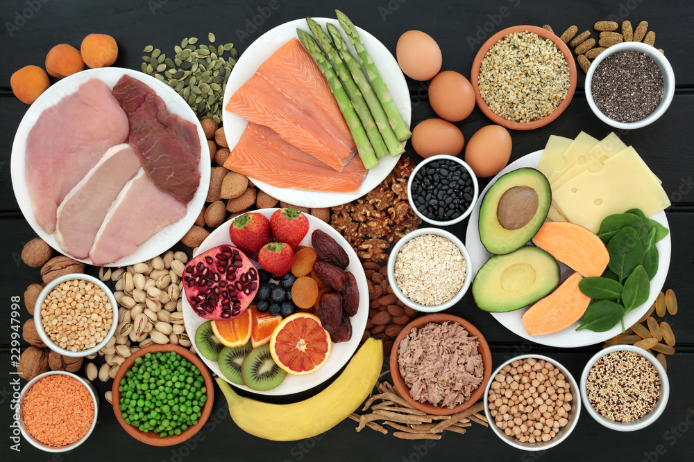
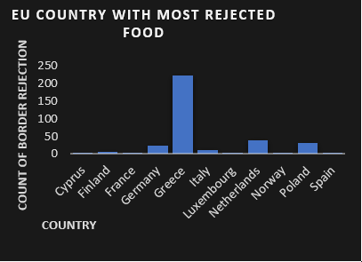
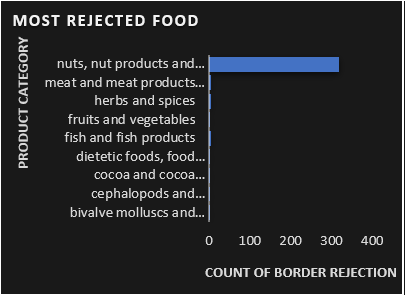
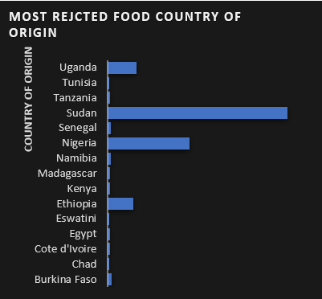
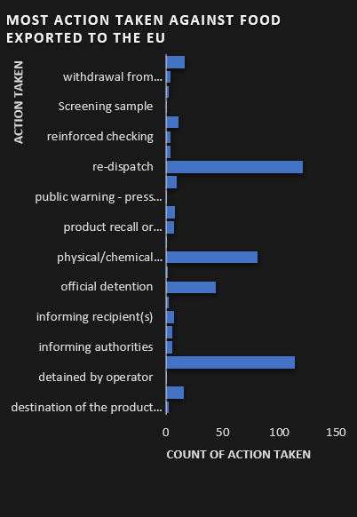
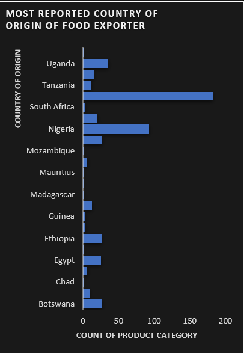
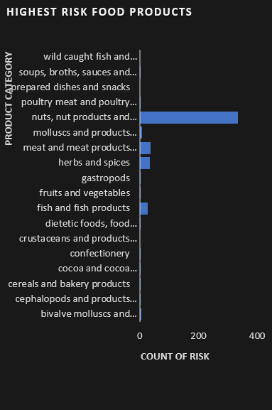
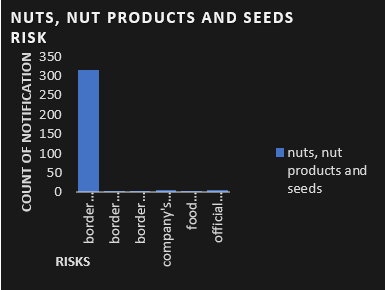

# HiCi_LTD_Analysis

## Introduction

This is an excel project on HiCi LTD. HiCi Ltd is a company which deals mainly in the exportation of local food such as herbs and 
spices, nuts, meats, fish and its products and so many other foods. It is expanding to the 
European Union and as a result had to encounter risks of product rejection and detaining of 
the consignment as reported by the EU Food Safety Standard Agency. It also needs to 
overcome various regulatory hurdles to be able to penetrate the European Union market. 
The hurdles include border rejection and mass destruction of substandard product among 
others.

## Problem statement

a. Which EU member country reports the highest number of food rejection?
b. What is the most rejected food?
c. Which country of origin has the most rejected food?
d. What is the most action taken against food exported to the EU?
e. What is the most reported origin (country) of food export?

## Visualization

1. EU country with most rejected food
2. Most rejected food
3. Most rejected food country of origin
4. Most action taken against food exported to the EU
5. Most reported country of origin of food exporter
6. Highest risk food product
7. Nuts, nuts product and seed risk

### EU country with most rejected food

Greece is the European Union member country that reports the highest number of 
food rejection out of sixteen (16) other member countries

### Most rejected food

The most rejected food is nuts, nut products and seeds

###  Most rejected food country of origin

Sudan is the country of origin of the most rejected food

### Most action taken against food exported to the EU

The most action taken against food exported to the European Union is re-dispatch

### Most reported country of origin of food exporter

The most reported country of origin of food export is Sudan

### Highest risk food products

Going by the above insights, it will be worthy to note that the food product with the highest 
risk is nuts, nut products and seeds. This is because it’s the most rejected food by the 
European Union member countries probably due to non-compliance with the EU food safety 
standards. Also, according to the data, Sudan is the country of origin of the most rejected 
foods. This particular food product (nuts, nut products and seeds) is a product of Sudan and 
consequently risk rejection which might be as a result of improper handling and 
consequently contamination. 

### Nuts, nut product and seed risk

Nuts, nut products and seeds have risk of food poisoning, product rejection, then border 
control which could cause the consignment to be detained, released or under customs. And 
the highest of the risks is consignment detained which means that the products would not 
be in the market not to talk of recording sales.

### Recommendations and Conclusion

The food products that HiCi Ltd should focus on are those with the lowest risk. These include 
but not limited to confectionery, cereals and bakery products, dietetic foods and food 
supplements, cocoa and cocoa preparations, coffee and tea. 

HiCi Ltd should also focus on food products from countries of origin with the lowest number 
of rejections, such as Chad, Tunisia, Tanzania and a host of others. HiCi Ltd should ensure 
that these food products meet the European Union food safety standards to reduce the risk 
of rejection.
